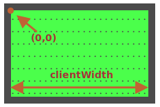

La palla ha `position:absolute`. Ciò significa che le coordinate `left/top` sono relative all'elemento posizionato più prossimo, cioè `#field` (perché ha `position:relative`).

Le coordinate sono a partire dall'angolo interno superiore sinistro del campo:



Le dimensioni interne del campo si calcolano con `clientWidth/clientHeight`. I valori delle coordinate del centro del campo quindi si ottengono con `(clientWidth/2, clientHeight/2)`.

...Ma se impostiamo tali valori per `ball.style.left/top`, allora si troverebbe al centro non la palla ma il suo bordo superiore sinistro

```js
ball.style.left = Math.round(field.clientWidth / 2) + 'px';
ball.style.top = Math.round(field.clientHeight / 2) + 'px';
```

Ecco cosa otterremmo:

[iframe height=180 src="ball-half"]

Per allineare il centro della palla con il centro del campo, dovremmo spostare la palla alla metà della sua larghezza a sinistra ed alla metà della sua altezza verso l'alto:

```js
ball.style.left = Math.round(field.clientWidth / 2 - ball.offsetWidth / 2) + 'px';
ball.style.top = Math.round(field.clientHeight / 2 - ball.offsetHeight / 2) + 'px';
```

Adesso la palla è finalmente centrata.

````warn header="Attenzione: c'è una difficoltà imprevista!"

Il codice non funzionerà in modo affidabile finché `` non avrà larghezza ed altezza definite:

```html

```
````

Quando il browser non conosce le dimensioni di un'immagine (dagli attributi del tag o dai CSS), allora assume che siano pari a `0` finché l'immagine non completa il caricamento.

Pertanto il valore di `ball.offsetWidth` sarà `0` fino al momento in cui l'immagine non viene caricata. Questo causerà coordinate errate nel codice sopra.

Dopo il primo caricamento, il browser solitamente mette in cache l'immagine, e ne ricorderà subito le dimensioni se la dovesse ricaricare. Al primo caricamento, tuttavia, il valore di `ball.offsetWidth` è `0`.

Dovremmo correggere aggiungendo `width/height` a ``:

```html

```

...o fornire le dimensioni nei CSS:

```css
#ball {
  width: 40px;
  height: 40px;
}
```
